# Projeto "Olympics Dataset"

# Equipe "Liga Olímpica" - AJJLO
* Áureo Henrique e Silva Marques - 213374
* José Alexandre dos Santos Barros - 176566
* Lindon Jonathan Sanley dos Santos Pereira Monroe - 220407

## Resumo do Projeto
Este projeto tem como objetivo a construção de um banco de dados cujo tema é o histórico dos Jogos Olímpicos nos últimos anos.

Os Jogos Olímpicos, ou Olimpíadas, são o maior evento esportivo do mundo e, de 4 em 4 anos, reúnem milhares de atletas de vários países. Embora suas origens sejam da Grécia Antiga, as primeiras Olimpíadas ocorreram oficialmente em 1896, organizadas pelo Comitê Olímpico Internacional (COI) e, portanto, desse ano até hoje, tratam-se de mais de 30 edições dos jogos olímpicos.

Essa grande quantidade de jogos resulta em uma grande quantidade de informações sobre os atletas, os países participantes, os países sede, as medalhas, os esportes, os vencedores de cada modalidade, entre outros. No entanto, encontrar um banco de dados com todas essas informações de forma centralizada e bem organizada é difícil, pois os dados disponíveis hoje na internet, em geral, são bancos de dados de algum ano específico das Olimpíadas ou bancos que abordam sobre várias Olimpíadas, mas que não possuem um modelo lógico bem estruturado, dificultando certos tipos de análise.

Com isso, o objetivo desse projeto é, através dos diversos bancos de dados existentes e através de pesquisas na internet, construir um dataset sobre os Jogos Olímpicos dos últimos anos que seja organizado e bem estruturado, permitindo diversos tipos de análises sobre o tema. Devido a possíveis limitações relacionadas ao grande número de edições dos Jogos, ainda vamos decidir exatamente quantos anos o dataset irá abordar, mas, inicialmente, pensamos em reunir os dados de, pelo menos, todos os jogos realizados no século XXI.

## Modelo Conceitual

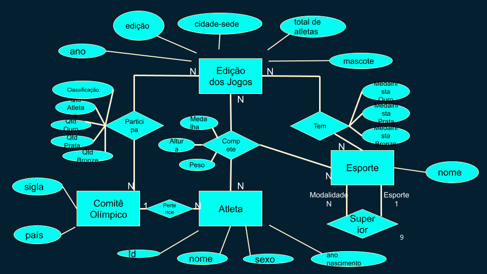

## Modelos Lógicos

~~~
EdicaoDosJogos (_Ano_, NumeroDaEdicao, CidadeSede, TotalDeAtletas, Mascote)

Atleta (_Id_, Nome, AnoDeNascimento, Sexo)

ComiteOlimpico(_Sigla_, País)

EsporteModalidade(_Id_, Nome, EsportePai)

ParticipacaoComites(_IdComite_, _AnoEdicao_,  QtdAtletas, QtdOuro , QtdPrata , QtdBronze, Classificacao)
  IdComite chave estrangeira -> ComiteOlimpico(Sigla)
  AnoEdicao chave estrangeira -> EdicaoDosJogos(Ano)

ParticipacaoAtletas(_IdAtleta_, _AnoEdicao_, _IdModalidade_, Altura, Peso, Medalha)
  IdAtleta chave estrangeira -> Atleta(Id) 
  AnoEdicao chave estrangeira -> EdicaoDosJogos(Ano)
  IdModalidade chave estrangeira -> EsporteModalidade(Id)

ComiteDosAtletas(_IdComite_,_IdAtleta_)
  IdComite chave estrangeira -> ComiteOlimpico(Sigla) 
  IdAtleta chave estrangeira -> Atleta(Id)

EsportesDasEdicoes(_AnoEdicao_, _IdModalidade_, Ouro, Prata, Bronze)
  AnoEdicao chave estrangeira -> EdicaoDosJogos(Ano)
  IdModalidade chave estrangeira -> EsporteModalidade(Id)
~~~

## Dataset Publicado

título do arquivo/base | link | breve descrição
----- | ----- | -----
Edicoes | [edicoes.csv](./data/processed/edicoes.csv) | Arquivo csv contendo tabela EdicaoDosJogos referente ao modelo lógico relacional
Atletas | [atletas.csv](./data/processed/atletas.csv) | Arquivo csv contendo tabela Atleta referente ao modelo lógico relacional
Comites | [comites.csv](./data/processed/comites.csv) | Arquivo csv contendo tabela ComiteOlimpico referente ao modelo lógico relacional
EsporteModalidade | [esportes.csv](./data/processed/esportes.csv) | Arquivo csv contendo tabela EsporteModalidade referente ao modelo lógico relacional
ParticipacaoComites | [participacaoComites.csv](./data/processed/participacaoComites.csv) | Arquivo csv contendo tabela ParticipacaoComites referente ao modelo lógico relacional
ParticipacaoAtletas | [participacaoAtletas.csv](./data/processed/participacaoAtletas.csv) | Arquivo csv contendo tabela ParticipacaoAtletas referente ao modelo lógico relacional
ComiteDosAtletas | [comiteDosAtletas.csv](./data/processed/comiteDosAtletas.csv) | Arquivo csv contendo tabela ComiteDosAtletas referente ao modelo lógico relacional
EsportesDasEdicoes | [esportesDasEdicoes.csv](./data/processed/esportesDasEdicoes.csv) | Arquivo csv contendo tabela EsportesDasEdicoes referente ao modelo lógico relacional
Edicoes-Tokyo | [edicoes-Tokyo.csv](./data/processed/edicoes-Tokyo.csv) | Arquivo csv contendo tabela EdicaoDosJogos referente ao modelo lógico relacional. Dados exclusivos da Olimpíada de Tokyo
Atletas-Tokyo | [atletas-Tokyo.csv](./data/processed/atletas-Tokyo.csv) | Arquivo csv contendo tabela Atleta referente ao modelo lógico relacional. Dados exclusivos da Olimpíada de Tokyo
Comites-Tokyo | [comites-Tokyo.csv](./data/processed/comites-Tokyo.csv) | Arquivo csv contendo tabela ComiteOlimpico referente ao modelo lógico relacional. Dados exclusivos da Olimpíada de Tokyo
EsporteModalidade-Tokyo | [esporteModalidade-Tokyo.csv](./data/processed/esporteModalidade-Tokyo.csv) | Arquivo csv contendo tabela EsporteModalidade referente ao modelo lógico relacional. Dados exclusivos da Olimpíada de Tokyo
ParticipacaoComites-Tokyo | [participacaoComites-Tokyo.csv](./data/processed/participacaoComites-Tokyo.csv) | Arquivo csv contendo tabela ParticipacaoComites referente ao modelo lógico relacional. Dados exclusivos da Olimpíada de Tokyo
ParticipacaoAtletas-Tokyo | [participacaoAtletas-Tokyo.csv](./data/processed/participacaoAtletas-Tokyo.csv) | Arquivo csv contendo tabela ParticipacaoAtletas referente ao modelo lógico relacional. Dados exclusivos da Olimpíada de Tokyo
ComiteDosAtletas-Tokyo | [comiteDosAtletas-Tokyo.csv](./data/processed/comiteDosAtletas-Tokyo.csv) | Arquivo csv contendo tabela ComiteDosAtletas referente ao modelo lógico relacional. Dados exclusivos da Olimpíada de Tokyo
EsportesDasEdicoes-Tokyo | [esportesDasEdicoes-Tokyo.csv](./data/processed/esportesDasEdicoes-Tokyo.csv) | Arquivo csv contendo tabela EsportesDasEdicoes referente ao modelo lógico relacional. Dados exclusivos da Olimpíada de Tokyo
Olimpiadas | [olimpiadas.json](./data/processed/olimpiadas.json) | Arquivo json contendo dados referentes ao modelo lógico hierárquico
OlimpiadasTokyo | [olimpiadasTokyo.json](./data/processed/olimpiadasTokyo.json) | Arquivo json contendo dados referentes ao modelo lógico hierárquico. Dados exclusivos da Olimpíada de Tokyo

## Bases de Dados

título da base | link | breve descrição
----- | ----- | -----
120 years of Olympic history: athletes and results | [Link](https://www.kaggle.com/heesoo37/120-years-of-olympic-history-athletes-and-results/discussion/69221) | Dataset histórico, uma tabela com dados das olimpíadas de 1896 a 2016
2021 Olympics in Tokyo | [Link](https://www.kaggle.com/arjunprasadsarkhel/2021-olympics-in-tokyo) |Dataset que consiste em uma tabela com dados específicos das olimpíadas de Tóquio em 2021. 
Olympics.com | [Link](https://olympics.com) |Site oficial do Comitê Olímpico Internacional (IOC) contendo uma base extensa de dados, notícias e informações sobre os Jogos Olímpicos e seus envolvidos, em geral.

## Perguntas/Análise com Resposta Implementada

### Pergunta/Análise 1

* Para um determinado esporte, existe algum país que constantemente é medalha de ouro?

  * **Uso do modelo relacional**

  * Para essa análise, serão selecionados os comites ganhadores de medalha de ouro para uma determinada modalidade, em todas as olimpíadas, e agrupados pelo próprio comite, de forma a contar quantas medalhas de ouro cada um teve.

  * Query SQL:

    ~~~sql
    SELECT E.Ouro, COUNT(*) QtdOuro 
      FROM EsportesDasEdicoes E, EsporteModalidade M
        WHERE M.Id=E.IdModalidade AND M.Nome='Athletics''s 100 meters'
        GROUP BY E.Ouro; 
    ~~~

  * Resultado:

    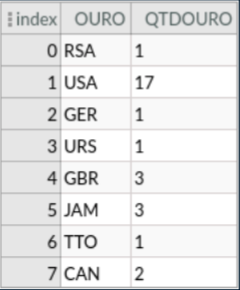

    Vemos que os Estados Unidos é o país com mais medalhas de ouro para a modalidade de 100m no atletismo.

### Pergunta/Análise 2

* Existe alguma relação entre altura do atleta e esporte praticado por ele? E em relação ao peso?

  * **Uso do modelo relacional**

  * Para essa análise, calculamos a media de altura dos atletas em cada modalidade, além da media geral da olímpiada. Com isso, podemos ver que modalidades tem maior e menor média tanto de altura como de peso.

  * Query SQL:

    ~~~sql
    /*Altura*/
    SELECT AnoEdicao, ROUND(AVG(CAST (Altura as float)),1) Media_altura
    FROM ParticipacaoAtletas
    WHERE AnoEdicao =2016 and Altura<>'-'
    GROUP BY AnoEdicao;

    SELECT * 
      FROM (
          SELECT E.EsportePai, E.Nome, ROUND(AVG(CAST (Altura as float)),1) Media_Altura
          FROM ParticipacaoAtletas P, EsporteModalidade E
          WHERE P.IdModalidade=E.Id and AnoEdicao=2016 and Altura<>'-'
          GROUP BY IdModalidade
          )
      ORDER BY MEDIA_ALTURA DESC
    ~~~
    ~~~sql
    /*Peso*/
    SELECT AnoEdicao, ROUND(AVG(CAST (Peso as float)),1) Media_peso
    FROM ParticipacaoAtletas
    WHERE AnoEdicao =2016 and Peso<>'-'
    GROUP BY AnoEdicao;

    SELECT * 
      FROM (
          SELECT E.EsportePai, E.Nome, ROUND(AVG(CAST (Peso as float)),1) Media_peso
          FROM ParticipacaoAtletas P, EsporteModalidade E
          WHERE P.IdModalidade=E.Id and AnoEdicao=2016 and Peso<>'-'
          GROUP BY IdModalidade
          )
      ORDER BY MEDIA_peso DESC
    ~~~

  * Resultado:

    Altura

    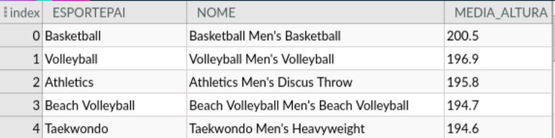
    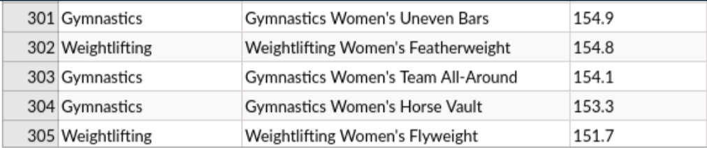

    Peso

    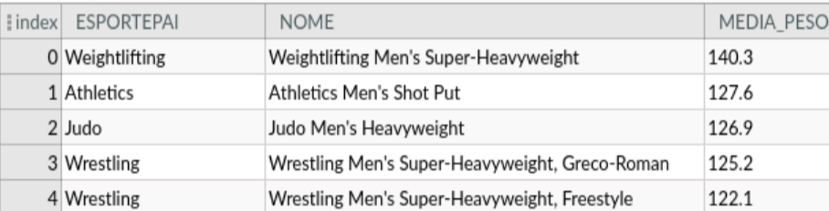
    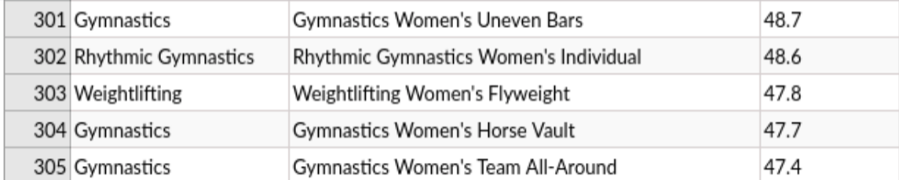

    Vemos que os atletas mais altos participam de esportes como basquete, volei, lançamento de disco e taekwondo, nas modalidades masculinas, enquanto que atletas mais baixos participam da ginástica e levantamento de peso, nas modalidades femininas. Já atletas de maior peso participam de esportes como levantamento de peso, lançamento de peso, judo e luta, nas modalidades masculinas, enquanto que os de menor peso participam de ginástica e ginástica rítmica, além de levantamento de peso, nas modalidades femininas.
    
### Pergunta/Análise 3

* Qual a média de idade dos atletas nas primeiras Olimpíadas? E nas últimas?

  * **Uso do modelo relacional**

  * Para essa análise, a idade dos atletas é calculada com base no seu ano de nascimento e a edição em que participa. Em seguida, calculamos a média de idade por edição.

  * Query SQL:

    ~~~sql
    CREATE VIEW Idade AS
    SELECT P.IdAtleta, P.AnoEdicao, (P.AnoEdicao-cast (A.AnoDeNascimento as float)) AS idade
        FROM Atleta A, ParticipacaoAtletas P
        WHERE A.Id=P.IdAtleta and A.AnoDeNascimento<>'-';

    SELECT AnoEdicao, ROUND(AVG(idade),0) Media_Idade
        FROM Idade
        GROUP BY AnoEdicao
        ORDER BY AnoEdicao
    ~~~

  * Resultado:

    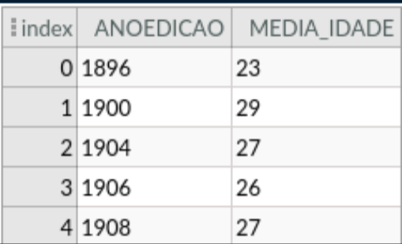
    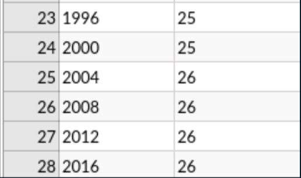

    É possível ver que as médias permaneceram relativamente as mesmas, na faixa dos 20 a 30 anos.
      
### Pergunta/Análise 4
 
* No período da Guerra Fria, é possível ver o predomínio das duas grandes potências nos pódios das Olímpiadas?

  * **Uso do modelo relacional**

  * Para essa análise, buscamos a classificação dos Estados Unidos e da União Soviética no periodo entre 1947 e 1989 (periodo da Guerra Fria).

  * Query SQL:

    ~~~sql
    SELECT AnoEdicao, IdComite, Classificacao
      FROM ParticipacaoComites
      WHERE (IdComite='USA' OR IdComite='URS') AND AnoEdicao>1947 AND AnoEdicao< 1989;
    ~~~

  * Resultado:

    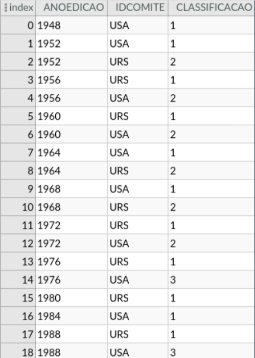

    Vemos que, realmente, EUA e URSS estão constantemente na liderança.
      
### Pergunta/Análise 5
 
* Qual a proporção de atletas do sexo masculino e do sexo feminino participando nos Jogos Olímpicos?

  * **Uso do modelo relacional**

  * Para essa análise, selecionamos o sexo dos atletas e agrupamos os dados de forma a encontrar o total de atletas do sexo masculino ou feminino em uma determinada edição.

  * Query SQL:

    ~~~sql
    SELECT P.ANOEDICAO, A.SEXO, COUNT(*) TOTAL
      FROM ATLETA A, PARTICIPACAOATLETAS P
      WHERE A.ID=P.IDATLETA
      GROUP BY P.ANOEDICAO, A.SEXO
      ORDER BY P.ANOEDICAO
    ~~~

  * Resultado:

    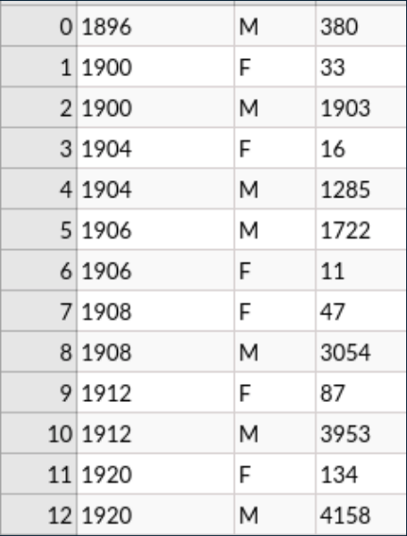
    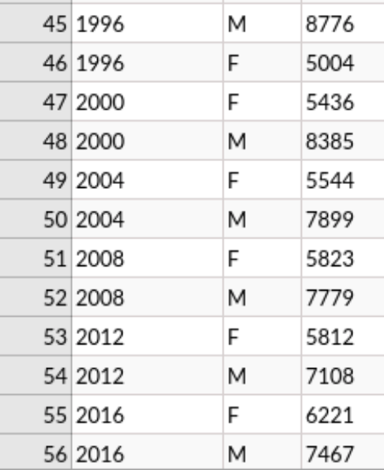

    Vemos que a proporção entre os sexos é bem discrepante nas primeiras olimpíadas e que essa diferença vem diminuindo nos jogos mais recentes.

### Pergunta/Análise 6

* Quais foram os países ganhadores de medalha de ouro no esporte X nas últimas 5 Olimpíadas?

  * **Uso do modelo hierárquico**

  * Para essa análise, percorremos o documento procurando os ganhadores de medalha de ouro do esporte desejado para as olimpíadas de 2000 a 2016.

  * Código python:

    ~~~python
    esporte="Judo"
    modalidade="Judo Women's Heavyweight"
    edicoes=["2016", "2012", "2008", "2004", "2000"]

    for i in range (5):
      ano=edicoes[i]
      for j in range (len(dados["edicoes"])-1, -1, -1):
        if (dados["edicoes"][j]["ano"]==ano):
          for k in range (len(dados["edicoes"][j]["esportesParticipantes"])):
            if (dados["edicoes"][j]["esportesParticipantes"][k]["nome"]==esporte):
              for l in range (len(dados["edicoes"][j]["esportesParticipantes"][k]["modalidades"])):
                if (dados["edicoes"][j]["esportesParticipantes"][k]["modalidades"][l]["nome"]==modalidade):
                  print(dados["edicoes"][j]["ano"]+": "+dados["edicoes"][j]["esportesParticipantes"][k]["modalidades"][l]["ouro"])
                  break   
    ~~~

  * Resultado:

    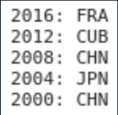

    Ganhadores de medalha de ouro na modalidade "Judo Women's Heavyweight"

### Pergunta/Análise 7

* Quais as modalidades realizadas pelo atleta X na Olimpíada X?

  * **Uso do modelo hierárquico**

  * Para essa análise, percorremos o documento procurando as modalidades realizadas pelo atleta desejado em uma olimpíada específica.

  * Código python:

    ~~~python
    #Selecionando a olimpíada (Através do ano):
    ano="2004"
    #Selecionando o atleta (Através do nome):
    atleta="Daiane Garcia dos Santos"

    for j in range (len(dados["edicoes"])):
      if (dados["edicoes"][j]["ano"]==ano):
        numero=j
        break

    for k in range (len(dados["edicoes"][numero]["atletasParticipantes"])):
      if (dados["edicoes"][numero]["atletasParticipantes"][k]["nome"]==atleta):
        for l in range (len(dados["edicoes"][numero]["atletasParticipantes"][k]["esportes"])):
          print(dados["edicoes"][numero]["atletasParticipantes"][k]["esportes"][l]["nomeModalidade"]) 
    ~~~

  * Resultado:

    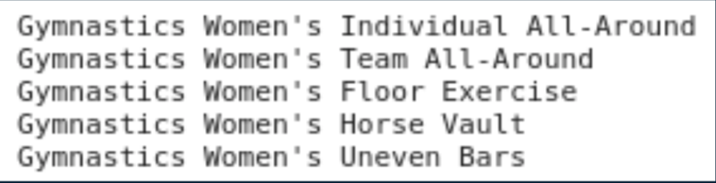

    Modalidades realizadas por Daiane dos Santos em 2004

## Perguntas/Análise propostas mas não  implementada

### Pergunta/Análise 1

* Quais os países que mais ganharam medalhas e os países que menos ganharam medalhas em uma determinada Olimpíada?

  * **Uso do modelo relacional**

  * Podemos selecionar os comites de maior e menor classificação em uma edição específica e até mesmo comparar entre diversas edições para analisar se os países alto classificados mantém sua posição e se os países de baixa classificação tem alguma evolução.

### Pergunta/Análise 2

* Qual o número médio de medalhas de um país nas Olimpíadas que ele participou?

  * **Uso do modelo relacional**

  * Podemos calcular essa média para analisar que países conseguem manter um alto número de medalhas nas edições. Para isso, deve-se somar a quantidade de medalhas de ouro, prata e bronze de um comite para cada edição e, por fim, realizar a média.

### Pergunta/Análise 3

* Em quantas Olimpíadas um determinado atleta participou e quantas medalhas ele ganhou?

  * **Uso do modelo relacional**

  * Trata-se de uma pergunta que busca saber o histórico de um atleta nas edições. Através da tabela de "participação dos atletas" podemos somar suas paticipações em jogos e as medalhas que conquistou.

### Pergunta/Análise 4

* Quais países que mais trazem atletas para os Jogos Olímpicos nas últimas edições?

  * **Uso do modelo relacional**

  * Através da tabela de "participação dos comites", podemos obter facilmente essa informação e comparar entre os diversos anos para inferir quais países trazem mais atletas e, até mesmo, ver se isso tem uma relação com seu desempenho nos jogos.

### Pergunta/Análise 5

* Para um determinado país, há uma tendência de piora ou de melhora no desempenho, nas Olimpíadas em que participou?

  * **Uso do modelo relacional**

  * Através da tabela de "participação dos comites", podemos ver se um país apresenta queda ou subida no número de medalhas e em sua classificação.

### Pergunta/Análise 6

* Na Olímpiada de 1936, como foi o desempenho da Alemanha Nazista?

  * **Uso do modelo relacional ou hierárquico**

  * Pergunta voltada para um contexto histórico de pré Segunda Guerra Mundial e que busca saber qual foi o desempenho da Alemanha nos jogos sediados em seu próprio país. Podemos analisar seu número de medalhas, classificação e modalidades em que ficou no pódio. 

### Pergunta/Análise 7

* Qual o número de atletas por país em uma determinada Olimpíada?

  * **Uso do modelo hierárquico**

  * Podemos procurar a edição desejada no json e percorrer o vetor de comites participantes, analisando a quantidade de atletas deles.

### Pergunta/Análise 8

* Quais os atletas participantes de uma determinada Olimpíada e suas respectivas informações?

  * **Uso do modelo hierárquico**

  * Pergunta voltada para obter um conjunto de informações encapsuladas, o que é característico do modelo hierárquico. Para isso, podemos procurar a edição desejada no json e retornar o vetor de atletas participantes.

### Pergunta/Análise 9

* Quais os comitês participantes de uma determinada Olimpíada e seus respectivos desempenhos?

  * **Uso do modelo hierárquico**

  * Pergunta voltada para obter um conjunto de informações encapsuladas, o que é característico do modelo hierárquico. Para isso, podemos procurar a edição desejada no json e retornar o vetor de comites participantes.

### Pergunta/Análise 10

* Quais os esportes de uma determinada Olimpíada e os resultados de pódio?

  * **Uso do modelo relacional ou hierárquico**

  * Pergunta voltada para obter um conjunto de informações encapsuladas, o que é característico do modelo hierárquico. Para isso, podemos procurar a edição desejada no json e retornar o vetor de esportes participantes.

