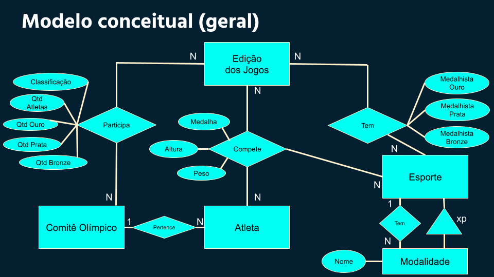

# Projeto "Olympics Dataset"

# Equipe "Liga Olímpica" - AJJLO
* Áureo Henrique e Silva Marques - 213374
* José Alexandre dos Santos Barros - 176566
* Lindon Jonathan Sanley dos Santos Pereira Monroe - 220407

## Resumo do Projeto
Este projeto tem como objetivo a construção de um banco de dados cujo tema é o histórico dos Jogos Olímpicos nos últimos anos.

Os Jogos Olímpicos, ou Olimpíadas, são o maior evento esportivo do mundo e, de 4 em 4 anos, reúnem milhares de atletas de vários países. Embora suas origens sejam da Grécia Antiga, as primeiras Olimpíadas ocorreram oficialmente em 1896, organizadas pelo Comitê Olímpico Internacional (COI) e, portanto, desse ano até hoje, tratam-se de mais de 30 edições dos jogos olímpicos.

Essa grande quantidade de jogos resulta em uma grande quantidade de informações sobre os atletas, os países participantes, os países sede, as medalhas, os esportes, os vencedores de cada modalidade, entre outros. No entanto, encontrar um banco de dados com todas essas informações de forma centralizada e bem organizada é difícil, pois os dados disponíveis hoje na internet, em geral, são bancos de dados de algum ano específico das Olimpíadas ou bancos que abordam sobre várias Olimpíadas, mas que não possuem um modelo lógico bem estruturado, dificultando certos tipos de análise.

Com isso, o objetivo desse projeto é, através dos diversos bancos de dados existentes e através de pesquisas na internet, construir um dataset sobre os Jogos Olímpicos dos últimos anos que seja organizado e bem estruturado, permitindo diversos tipos de análises sobre o tema. Devido a possíveis limitações relacionadas ao grande número de edições dos Jogos, ainda vamos decidir exatamente quantos anos o dataset irá abordar, mas, inicialmente, pensamos em reunir os dados de, pelo menos, todos os jogos realizados no século XXI.

Um esboço do modelo conceitual do nosso dataset pode ser visto na figura abaixo:

O dataset pretende utilizar os modelos lógicos relacional e de documentos. O modelo relacional será utilizado para associar tabelas das diferentes fontes e organizar os dados de forma mais intuitiva, refinada e organizada. A maneira como o modelo de documentos será utilizado ainda será avaliado, dependendo dos dados que obtivermos das novas fontes e da complexidade que almejarmos dar ao dataset.

As fontes de dados que já pretendemos utilizar no dataset são as seguintes:

* Dataset histórico, uma tabela com dados das olimpíadas de 1896 a 2016. Foi criado a partir de dados do site [www.sports-reference.com](www.sports-reference.com).
[Link para o dataset](https://www.kaggle.com/heesoo37/120-years-of-olympic-history-athletes-and-results/discussion/69221)
* Dataset que consiste em uma tabela com dados específicos das olimpíadas no Rio de Janeiro em 2016.
[Link para o dataset](https://www.kaggle.com/rio2016/olympic-games)
* Dataset que consiste em uma tabela com dados específicos das olimpíadas em Tóquio em 2021.
[Link para o dataset](https://www.kaggle.com/arjunprasadsarkhel/2021-olympics-in-tokyo)

Novas fontes serão adicionadas no decorrer do desenvolvimento do projeto, em especial, de modo a se encontrar informações mais específicas em relação a cada edição dos jogos olímpicos que serão abordadas.

As operações que já podemos assumir que serão aplicadas a essas fontes são: integração, associando os dados de múltiplas fontes; transformação, organizando os dados mais eficientemente.

Através do nosso dataset, planejamos possibilitar análises como: 

* Quais os países que mais ganharam medalhas e os países que menos ganharam medalhas em uma determinada Olimpíada?
* Qual o número médio de medalhas de um país nas Olimpíadas que ele participou?
* Qual o número de atletas por país em uma determinada olimpíada?
* Quais foram os países ganhadores de medalha de ouro no esporte X nas últimas 5 olimpíadas?
* Qual a proporção de atletas do sexo masculino e do sexo feminino participando nos Jogos Olímpicos?
* Em quantas Olimpíadas um determinado atleta participou e quantas medalhas ele ganhou?
* Quais países que mais trazem atletas para os Jogos Olímpicos?
* Para um determinado esporte, existe algum país que constantemente está no pódio?
* Para os países que trazem um número reduzido de atletas, em quais esportes eles costumam participar?

## Slides da Apresentação
[Link para slides](slides/slides.pdf)